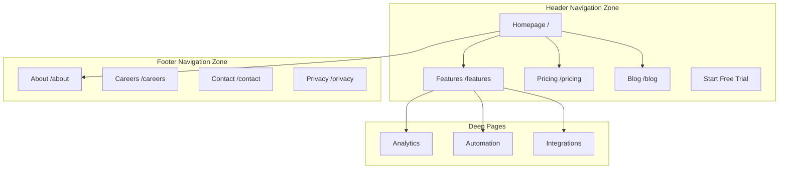
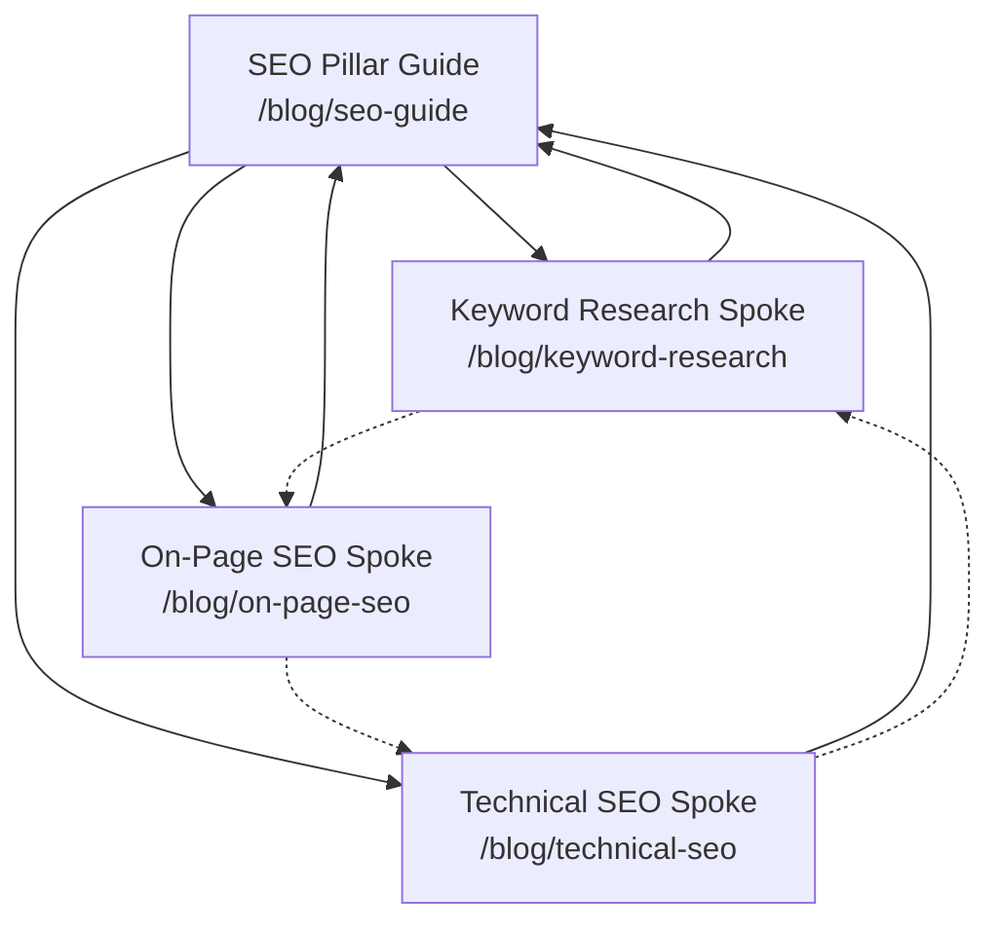

# Site Architecture

Plan website information architecture — page hierarchy, navigation elements, URL patterns, and internal linking strategies — to create highly intuitive user experiences and optimal search engine crawlability.

## When to Use

- Planning, mapping, or restructuring a website's page hierarchy or main navigation.
- Designing URL routing path structures and breadcrumb flows.
- Developing internal linking strategies (such as hub-and-spoke models) for content or SEO.
- Visualizing information architecture (IA) using sitemaps and tree representations.

## When NOT to Use

- Writing technical XML sitemaps for SEO indexes.
- Drafting backend API schema parameter routes or relational database structures.
- Managing physical network topology, switch routing configs (e.g., BGP), or link-state boundaries.

---

## Planning Parameters

Before constructing or restructuring a sitemap, gather the following context:

### 1. Business Context
- What is the primary purpose of the product or company?
- Who represent the target audience segments?
- What are the top three goals for the site? (e.g., product conversions, organic search traffic, user support, educational onboarding).

### 2. Current State
- Is this a new greenfield site, or a restructuring pass on an existing domain?
- If restructuring, what is currently broken? (e.g., high bounce rates, falling SEO traffic, users unable to discover products).
- Are there existing critical URLs that must be preserved or 301-redirected?

### 3. Website Type & Baseline Templates

| Site Type | Typical Depth | Key Sections | URL Pattern |
|---|---|---|---|
| **SaaS Marketing** | 2-3 levels | Home, Features, Pricing, Blog, Docs | `/features/{name}`, `/blog/{slug}` |
| **Content / Blog** | 2-3 levels | Home, Blog, Categories, Resources, About | `/blog/{slug}`, `/category/{slug}` |
| **E-Commerce** | 3-4 levels | Home, Categories, Subcategories, Products, Cart | `/shop/{category}/{product}` |
| **Documentation** | 3-4 levels | Home, Getting Started, Guides, API Reference | `/docs/{section}/{page}` |
| **Small Business** | 1-2 levels | Home, Services, Testimonials, About, Contact | `/services/{slug}` |

---

## Page Hierarchy Design

### The 3-Click Rule
Users should be able to reach any critical page on your site within **three clicks** from the homepage. If high-value content is buried four or more levels deep, flatten the structure.

### Flat vs. Deep Architectures

- **Flat (1-2 levels):** Best for small portfolios, local businesses, or simple landing sites. Highly discoverable but does not scale well.
- **Moderate (3 levels):** Best for SaaS marketing, content repositories, and digital publications. Ideal balance of findability and categorization.
- **Deep (4+ levels):** Best for large-scale e-commerce or massive developer documentation sites. Requires robust sidebar navigation and breadcrumbs to prevent users from getting lost.

*Rule of Thumb: Maintain the flattest hierarchy possible while keeping header navigation clean. If a dropdown menu exceeds 12-15 items, introduce a subcategory level.*

---

## Visual Sitemap Examples

### A. ASCII Tree Format
Use this format for textual, quick-to-parse hierarchy planning:

```text
Homepage (/)
├── Features (/features)
│   ├── Analytics (/features/analytics)
│   ├── Automation (/features/automation)
│   └── Integrations (/features/integrations)
├── Pricing (/pricing)
├── Blog (/blog)
│   ├── [Category: SEO] (/blog/category/seo)
│   └── [Category: CRO] (/blog/category/cro)
├── Resources (/resources)
│   ├── Case Studies (/resources/case-studies)
│   └── Templates (/resources/templates)
├── Docs (/docs)
│   ├── Getting Started (/docs/getting-started)
│   └── API Reference (/docs/api)
└── Contact (/contact)
```

### B. Mermaid Graphical Sitemap
Use Mermaid `graph TD` for visual representations, showcasing navigation zones and page relationships:



---

## Navigation Design Best Practices

### Header Navigation Rules
- **Limit to 4-7 primary items:** Exceeding this causes decision paralysis and causes header wrapping on small screens.
- **Rightmost CTA:** Place your primary call-to-action (e.g., "Get Started") at the far right, styled as a distinct button.
- **Logo Link:** The product logo must link directly back to the homepage `/`.
- **Order by Importance:** Position your highest-converting pages first (usually Features or Pricing).

### Footer Navigation Columns
Organize secondary or administrative links into 3-5 themed footer columns:
- **Product:** Features, Pricing, Integrations, Changelog
- **Resources:** Blog, Case Studies, Templates, Docs
- **Company:** About, Careers, Contact, Press
- **Legal:** Privacy Policy, Terms of Service, Security

### Breadcrumb Alignment
Breadcrumbs must programmatically mirror your URL path structure (e.g., `Home > Blog > SEO > Keyword Research` maps exactly to `/blog/category/seo/keyword-research`). Every segment of a breadcrumb should be a clickable link, except for the current page label.

---

## URL Structure Principles

- **Human Readable:** Use clean, intuitive slugs (e.g., `/features/analytics` instead of `/f/an-1224x`).
- **Hyphens over Underscores:** Use hyphens to separate words (e.g., `/blog/seo-guide` instead of `/blog/seo_guide`).
- **Strictly Lowercase:** Enforce lowercase URLs. Establish global redirects from capital letters to their lowercase counterparts (e.g., `/About` redirects to `/about`).
- **No Dates in Blog URLs:** Avoid including dates (e.g., `/blog/2026/06/14/post-name` adds no SEO value and makes URLs fragile. Prefer `/blog/post-name`).
- **Enforce Single Slash Policy:** Standardize on either utilizing or excluding trailing slashes, and enforce it globally with 301 redirects to prevent duplicate content indexing.

---

## Internal Linking & The Hub-and-Spoke Model

Maximize search engine crawlability and page authority using the **Hub-and-Spoke** (Topic Cluster) linking model:


- **Rules of the Cluster:**
  - Every Spoke page must contain a prominent anchor link returning to the core Hub page.
  - The Hub page must link to every Spoke page.
  - Spokes should cross-link to sibling Spokes when contextually relevant.
  - **No Orphan Pages:** Every single page in your architecture must have at least one inbound internal link pointing to it.

---

## Anti-Patterns to Avoid

- **No Firewall on Pages (Orphan pages):** Publishing pages that have zero inbound internal links, rendering them invisible to search engine crawlers.
- **Over-nesting Directory Paths:** Nesting URLs excessively (e.g., `/shop/category/subcategory/item/detail/specs/model-123` is too deep. Flatten to `/shop/category/product-slug`).
- **Dynamic Query Parameters:** Using query parameters to load primary site content (e.g., `/blog?id=123` should always be `/blog/post-title`).
- **Breaking URLs without redirects:** Relocating or renaming pages without creating persistent `301 redirects`. This breaks bookmarks, external links, and destroys search engine index rank.

## See Also

- Skill: [[security-and-hardening]] (for secure application routes)
- Skill: [[api-and-interface-design]] (for software API boundary planning)
