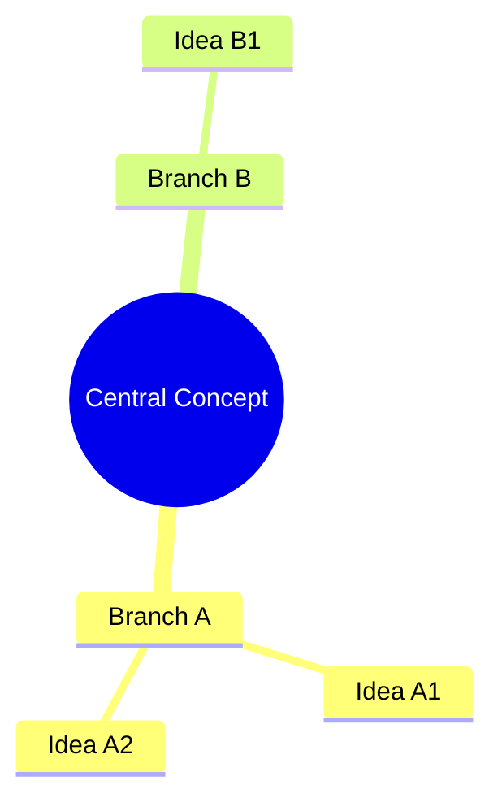

# Mind Map (Obsidian)

Turn ideas into a **visual** structure in an Obsidian vault. The best output is a
native **JSON Canvas** (`.canvas`) file — Obsidian opens it as a real, draggable
canvas, and nodes can link to existing notes so the map is navigable, not an
island. Pick the lightest format that fits the need; never write outside the vault.

## Setup

- **Vault path:** ask the user for their vault root if unknown; write only inside it.
- **Where to save:** a `Maps/` or `Canvas/` folder, or beside the source note. Match
  the user's existing structure; ask if ambiguous.
- Relates to [[knowledge-capture-obsidian]] (that captures notes; this visualizes them).

## Choose the output format

| Format | File | Best for |
|--------|------|----------|
| **JSON Canvas** (default) | `<name>.canvas` | A true visual mind map; spatial layout; nodes that link to vault notes |
| **Mermaid mindmap** | a `.md` note with a ```mermaid fence | Quick radial map inline in a note; diffable in plain text |
| **Wikilink outline** | a `.md` note | When it should feed the graph view and stay editable prose |

If the user just says "mind map," default to **JSON Canvas**.

## Workflow

### 1) Gather the material
Topic from the user, an existing note (read it first), the conversation, or a set
of vault notes (Grep/Glob to find them). Identify the **one central concept**.
When a study note contains `## Mind map seeds`, treat verified wikilinks as
navigation candidates and plain-text seeds as ideas only. A plain-text seed does
not authorize a file node, wikilink, or asserted cross-edge.

### 2) Build the structure before drawing
- Central node → main branches (3–7 is ideal) → sub-branches.
- Keep node labels short (a phrase, not a paragraph).
- Note **cross-links** between branches (these become extra edges, not tree edges).
- Where a branch corresponds to an existing vault note, plan a **file node** /
  `[[wikilink]]` so the map connects into the vault.

### 3) Generate the chosen format

**JSON Canvas** — write valid `.canvas` JSON per `references/json-canvas-spec.md`.
Use the layout recipe there to assign `x`/`y` so it doesn't open as a pile. Use
**file nodes** for branches that are real notes; **text nodes** for pure ideas;
color-code branches (presets `"1"`–`"6"`). Connect with edges (central → branch →
sub-branch), plus dashed/colored edges for cross-links.

**Mermaid mindmap** — embed in a note:
````markdown

````
Indentation = hierarchy. `root((text))` is the center. Good for a fast, text-only map.

**Wikilink outline** — a markdown note with nested bullets where each concept that
is (or should be) its own note is a `[[wikilink]]`; Obsidian's graph view then
renders the relationships. Best when the map should double as editable content.

### 4) Connect, don't orphan
Prefer linking to existing notes (`file` nodes / `[[wikilinks]]`) over duplicating
their content. Verify every file node and optional heading subpath immediately
before writing. When this skill is called by `study-map`, write only in `Maps/`
and let `study-map` run its integrity lint before release. Add a standalone new
canvas/note to a relevant existing MOC or source note so it is discoverable;
never create a dangling backlink merely to avoid an orphan.

### 5) Report
Tell the user the file path, the format, and how to open it (Canvas files open on
click; Mermaid renders in Reading/Live Preview). Offer to expand a branch, recolor,
or convert between formats.

## Layout & quality rules (canvas)
- Central node near `(0, 0)`; branches radiate outward; sub-branches further out.
- Leave generous spacing (see the spec reference) so nodes don't overlap.
- One color per main branch; keep the central node a distinct color.
- 3–7 main branches; split further if a branch has >7 children.
- Short labels; put detail inside the linked note, not the node.

## Reference
- `references/json-canvas-spec.md` — the JSON Canvas 1.0 schema, a valid worked
  example, the radial layout recipe, color presets, and the Mermaid mindmap syntax.
