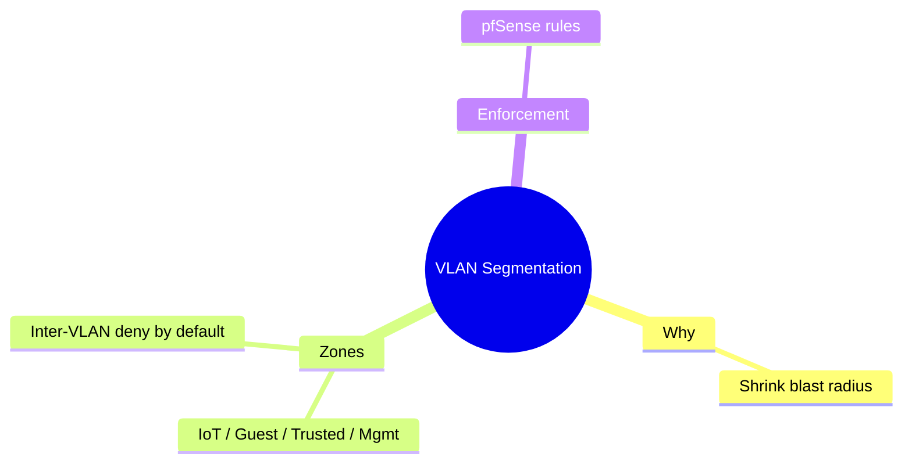

# JSON Canvas 1.0 — reference for mind-map generation

Source spec: <https://jsoncanvas.org/spec/1.0/> (created for Obsidian, open format).
A `.canvas` file is a JSON document with two top-level arrays.

```json
{ "nodes": [ ... ], "edges": [ ... ] }
```

## Nodes

Every node has these **generic** attributes:

| Attr | Req | Notes |
|------|-----|-------|
| `id` | yes | unique string (e.g. `"n1"`, or a short slug) |
| `type` | yes | `"text"` \| `"file"` \| `"link"` \| `"group"` |
| `x` | yes | x position in **pixels** (integer; may be negative) |
| `y` | yes | y position in pixels (integer) |
| `width` | yes | width in pixels |
| `height` | yes | height in pixels |
| `color` | no | `canvasColor` — preset `"1"`–`"6"` or hex `"#RRGGBB"` |

Type-specific attribute:

- **text** → `text` (required, string; Markdown allowed) — pure idea nodes.
- **file** → `file` (required, vault-relative path, e.g. `"Notes/TCP Handshake.md"`); optional `subpath` (e.g. `"#heading"`). Use these to point a branch at a real note.
- **link** → `url` (required, string).
- **group** → `label` (optional, string); used as a labeled container behind other nodes.

## Edges

| Attr | Req | Notes |
|------|-----|-------|
| `id` | yes | unique string |
| `fromNode` | yes | id of the source node |
| `toNode` | yes | id of the target node |
| `fromSide` | no | `"top"` \| `"right"` \| `"bottom"` \| `"left"` |
| `toSide` | no | same set |
| `fromEnd` | no | `"none"` \| `"arrow"` (default `none`) |
| `toEnd` | no | `"none"` \| `"arrow"` (default `arrow`) |
| `color` | no | preset or hex |
| `label` | no | text shown on the edge |

## Color presets

`"1"` red · `"2"` orange · `"3"` yellow · `"4"` green · `"5"` cyan · `"6"` purple.
(Or any hex like `"#7E6BC4"`.) One preset per main branch; central node a distinct one.

## Radial layout recipe (so it doesn't open as a pile)

Coordinates are pixels; Obsidian's origin is arbitrary, so center on `(0,0)`.

1. **Central node** at roughly `x:-120, y:-40`, `width:240, height:80` (centers a 240×80 box on the origin).
2. **Main branches** (N of them): place on a ring of radius `R≈520`. For branch `i`:
   - `angle = 2π * i / N`
   - `cx = round(R * cos(angle))`, `cy = round(R * sin(angle))`
   - node `x = cx - width/2`, `y = cy - height/2` (typical `width:220, height:70`).
3. **Sub-branches** of a main branch: place on a smaller arc (radius `~200`) centered on that branch, fanned around its outward direction; `width:180, height:56`.
4. Keep ≥ `40px` clear between boxes; if a branch has many children, increase its arc radius or split the branch.

## Worked example (valid `.canvas`)

Central concept "VLAN Segmentation" with three branches, one linking to a real note.

```json
{
  "nodes": [
    { "id": "root", "type": "text", "x": -120, "y": -40, "width": 240, "height": 80, "color": "6", "text": "# VLAN Segmentation" },
    { "id": "b1", "type": "text", "x": 400, "y": -35, "width": 220, "height": 70, "color": "1", "text": "**Why**\nshrink blast radius" },
    { "id": "b2", "type": "file", "x": -260, "y": 340, "width": 220, "height": 70, "color": "4", "file": "Notes/pfSense Rules.md" },
    { "id": "b3", "type": "text", "x": -260, "y": -420, "width": 220, "height": 70, "color": "3", "text": "**Zones**\nIoT · Guest · Trusted · Mgmt" },
    { "id": "b3a", "type": "text", "x": -560, "y": -520, "width": 180, "height": 56, "color": "3", "text": "Inter-VLAN deny by default" },
    { "id": "b3b", "type": "text", "x": -560, "y": -360, "width": 180, "height": 56, "color": "3", "text": "Management VLAN isolated" }
  ],
  "edges": [
    { "id": "e1", "fromNode": "root", "toNode": "b1", "toEnd": "arrow" },
    { "id": "e2", "fromNode": "root", "toNode": "b2", "toEnd": "arrow", "label": "enforced on" },
    { "id": "e3", "fromNode": "root", "toNode": "b3", "toEnd": "arrow" },
    { "id": "e4", "fromNode": "b3", "toNode": "b3a", "toEnd": "arrow" },
    { "id": "e5", "fromNode": "b3", "toNode": "b3b", "toEnd": "arrow" },
    { "id": "e6", "fromNode": "b1", "toNode": "b3", "color": "5", "label": "drives", "toEnd": "arrow" }
  ]
}
```

`b2` is a **file node** pointing at an existing vault note — clicking it opens that
note, so the map is wired into the vault rather than duplicating content. `e6` is a
cross-link (different color) between two branches.

## Mermaid mindmap (the lighter alternative)

Obsidian renders this in a ```mermaid fence; indentation sets hierarchy.



Node shapes: `root((round))`, `[square]`, `(rounded)`, `{{hexagon}}`. Keep it to a
single root. Use this when a quick, diffable, text-only map beats a spatial canvas.
